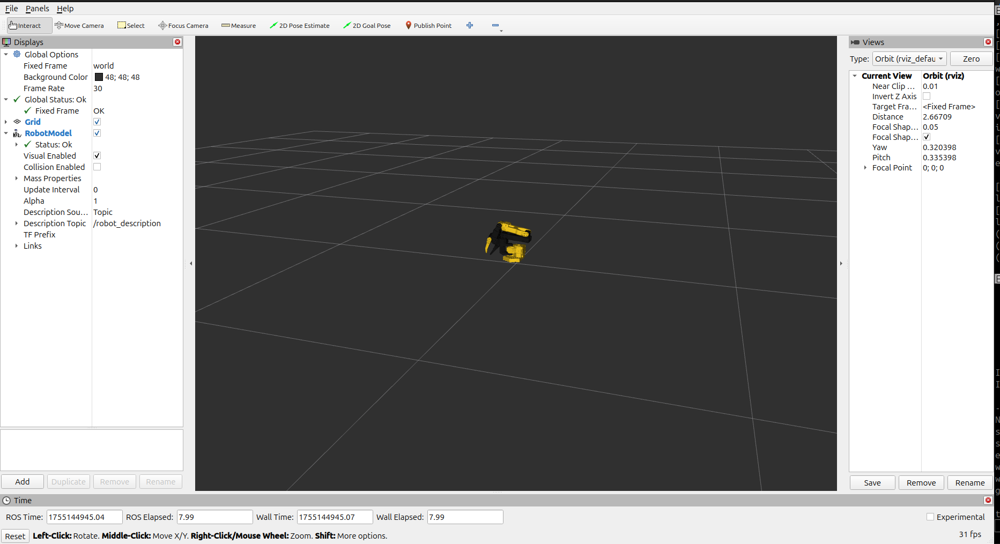
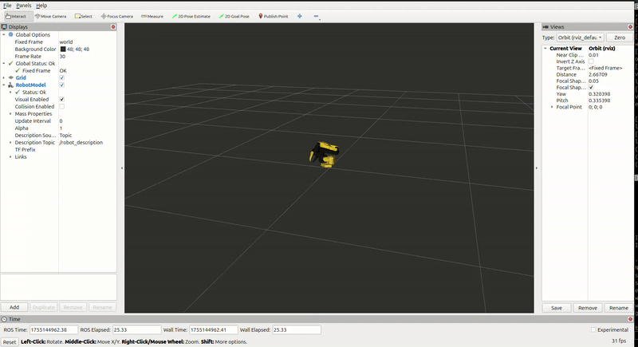

# SO-ARM101 Visualization Package

ROS2 package for real-time visualization of the SO-ARM101 robot arm with hardware interface.

## Features

- **Real Hardware Interface**: Directly reads joint positions from SO-ARM101 robot via serial communication
- **Real-time Visualization**: Live robot pose display in RViz2
- **TF Broadcasting**: Complete transform tree for robot kinematics
- **IK Teleoperation Support**: Publishes pose deltas for teleoperation applications
- **Error Handling**: Robust serial communication with automatic reconnection

## Dependencies

- ROS2 (Jazzy)
- Python packages: `serial`, `numpy`

## Installation

```bash
# Clone or copy this package to your ROS2 workspace src directory
cd ~/your_ros2_ws/src

# Install dependencies (if not already installed)
sudo apt install python3-serial python3-numpy

# Build the package
cd ~/your_ros2_ws
colcon build --packages-select so_arm_visualization

# Source the workspace
source install/setup.bash
```

## Usage

### Quick Start - Complete Visualization

Launch everything with one command:

```bash
ros2 launch so_arm_visualization so_arm_visualization.launch.py
```

This will start:
- Hardware joint state reader (connects to `/dev/ttyACM0`)
- Robot state publisher (URDF → TF transforms)
- RViz2 with robot visualization

## Hardware Setup

1. **Connect SO-ARM101**: Ensure robot is connected via USB (typically `/dev/ttyACM0`)
2. **Permissions**: 
   ```bash
   sudo chmod 666 /dev/ttyACM0
   ```
3. **Power On**: Make sure robot is powered and in normal operation mode

4. **Start SO-101 teleoperation from lerobot**:
   ```bash
   python -m lerobot.teleoperate \
      --robot.type=so101_follower \
      --robot.port=/dev/ttyACM0 \
      --robot.id=my_awesome_follower_arm \
      --teleop.type=so101_leader \
      --teleop.port=/dev/ttyACM1 \
      --teleop.id=my_awesome_leader_arm 
   ```

## Topics Published

- `/joint_states` (sensor_msgs/JointState): Real-time joint positions
- `/robot/cmd_pose` (geometry_msgs/Twist): End-effector pose deltas for teleoperation
- `/tf` and `/tf_static`: Robot transform tree

## Visualization Examples

### SO-ARM101 in RViz2



### Real-time Robot Movement



## Troubleshooting

### Robot Not Connecting
- Check USB connection and `/dev/ttyACM0` exists
- Verify user permissions 
- Try different USB ports or cables

### No TF Transforms
- Check that robot_state_publisher is running
- Verify URDF file exists 

### RViz Display Issues  
- Check that all TF frames are being published: `ros2 run tf2_tools view_frames`
- Verify robot model loads: look for errors in robot_state_publisher output
- Try different RViz configuration if default doesn't work

## Configuration

### Serial Port
Default: `/dev/ttyACM0` for the follower arm. Modify in `so_arm_joint_reader.py` if different.

### Update Rate
Default: 20Hz. Adjust timer in `so_arm_joint_reader.py` if needed.

## Package Structure

```
so_arm_visualization/
├── so_arm_visualization/
│   ├── __init__.py
│   └── so_arm_joint_reader.py          # Hardware interface
├── launch/
│   └── so_arm_visualization.launch.py  # Complete launch file
├── urdf/                               # Robot description files
│   ├── so101.urdf.xacro
│   ├── so101_base.xacro
│   ├── so101_gazebo.xacro
│   └── so101_ros2_control.xacro
├── rviz/                               # Visualization configuration
│   └── display.rviz
├── meshes/so101/                       # 3D mesh files 
├── package.xml                     
├── setup.py                       
└── README.md                      
```
